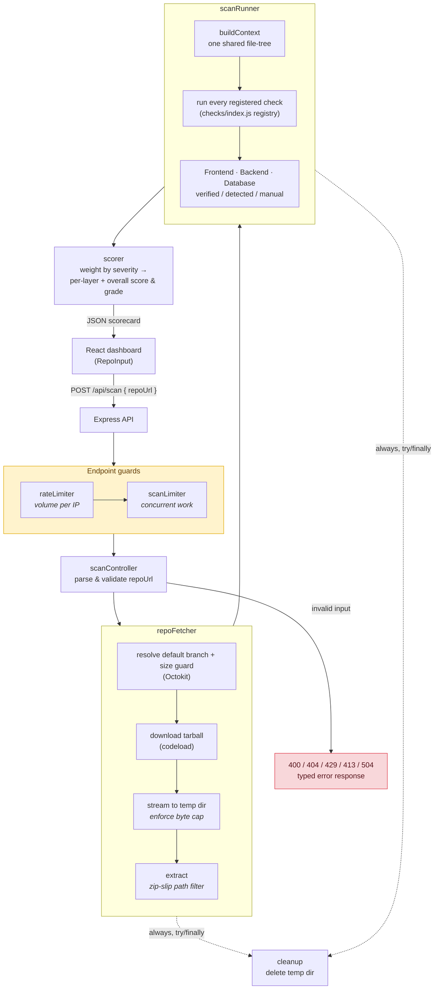

# Security Posture Scorecard

Point the tool at a public GitHub repo; it downloads the source, runs a set of
security checks across three layers, and returns a scored, graded report. Its
defining trait is that **every finding reports how confident the scan can be** —
`verified`, `detected`, or `manual` — so the tool never overclaims.


Live link: https://client-lime-alpha.vercel.app/

The confidence of a layer drops as you go deeper, and the tool is honest about it:

- **Frontend** — mostly `verified` (the flagship repo-wide secret scan lives here).
- **Backend** — mostly `detected` (heuristic usage; regex over source + manifest).
- **Database** — mostly `manual` (the things that matter most — encryption at rest,
  backups — can't be seen from source, so they're surfaced as a "confirm these
  yourself" checklist, never a fake green check).

Layers are marked **not applicable** when a repo has no backend / database, so a
frontend-only library isn't penalized for "missing rate limiting."

## What it checks (by layer & confidence tier)

**Frontend**
| Check | Tier |
| --- | --- |
| Exposed secrets (flagship) | `verified` |
| Client-exposed secrets (`VITE_`/`REACT_APP_`/`NEXT_PUBLIC_`) | `verified` |
| Type safety (`tsconfig`, `strict`, TS share) | `verified` |
| Security tooling present | `verified` |
| Input validation (library *used*) | `detected` |
| Route protection (guard pattern) | `detected` |

**Backend**
| Check | Tier |
| --- | --- |
| Wide-open CORS (`origin: '*'`) — a real, verifiable **fail** | `verified` |
| Known-vulnerable dependencies (OSV database, from lockfile) | `verified` |
| Auth library / rate limiting / security headers / logging present | `verified` |
| Password hashing used, authorization/role checks, rate-limit applied | `detected` |

**Database**
| Check | Tier |
| --- | --- |
| DB credentials not hardcoded (from `process.env`) | `verified` |
| Encryption in transit (TLS / `mongodb+srv`) | `detected` |
| Query safety (ORM vs. string-built queries) | `detected` |
| Schema/model validation, field-level encryption | `detected` |
| **Manual checklist** — encryption at rest, backups, least-privilege user, PITR | `manual` (advisory, unscored) |

## Architecture



Each check is a self-contained module of the same shape (`checks/**`), loaded
from a registry (`checks/index.js`). That plugin pattern is what makes Layers 2/3
additive — the runner, scorer, and dashboard never change to gain a layer.

## Scoring (transparent by design)

Severity weights: `critical 40 · high 25 · medium 15 · low 10`.
Each scored check earns its weight — `pass` = full, `warn` = half, `fail` = none.
`manual` items are informational and **excluded** from the score (you can't verify
them, so they don't penalize the repo). The report includes a "why this score"
breakdown.

## Run it

```bash
# 1. API (port 4000)
cd server
npm install
# optional: raises GitHub rate limit 60/hr -> 5000/hr
# export GITHUB_TOKEN=ghp_xxx
# optional: production CORS allowlist, comma-separated
# export ALLOWED_ORIGINS=https://your-dashboard.example
npm start

# 2. Dashboard (port 5173, proxies /api to the server)
cd client
npm install
# optional: production API base URL when the API is deployed separately
# export VITE_API_URL=https://your-api.example
npm run dev
```

Open http://localhost:5173 and scan a repo (try `sindresorhus/slugify`).

## API

| Method | Endpoint | Purpose |
| --- | --- | --- |
| `POST` | `/api/scan` | Body `{ repoUrl }` (URL or `owner/repo`) → full scorecard |
| `GET` | `/health` | Health check |

## Tests

The server is covered by the built-in Node test runner (`node:test`) — no extra
dependency. Fixtures write a throwaway repo to a temp dir and run real checks
over it (so `fileTree` is exercised too, not mocked).

The client has a small Vitest suite for the API wrapper and a Playwright smoke
test that runs the dashboard in desktop and mobile Chromium with the scan API
mocked for deterministic coverage.

```bash
cd server
npm test          # 73 tests
npm run test:watch

cd client
npm test
npm run test:e2e
npm run build
```

Covered: the flagship secret scanner (each secret type, placeholder suppression,
committed-`.env` / `.gitignore` logic, private-key files, `node_modules`/lockfile
exclusion, line numbers), client-secret exposure, backend checks (auth/cors/rate-
limit/helmet/hashing/authz + not-applicable detection), database checks (hardcoded
creds, TLS, query safety, schema, manual checklist), the OSV lockfile parser, the
scorer's weighting + checklist-lifting + not-applicable roll-up, the glob helper,
`typeSafety`, and repo-URL parsing.

## Reliability notes

- Public repos only. Optional `GITHUB_TOKEN` raises the rate limit.
- Repo size cap + whole-scan timeout so a huge repo can't hang the request.
- Temp dir is always cleaned up, even on error.
- `node_modules` and lockfiles are excluded from the scan to cut noise.
